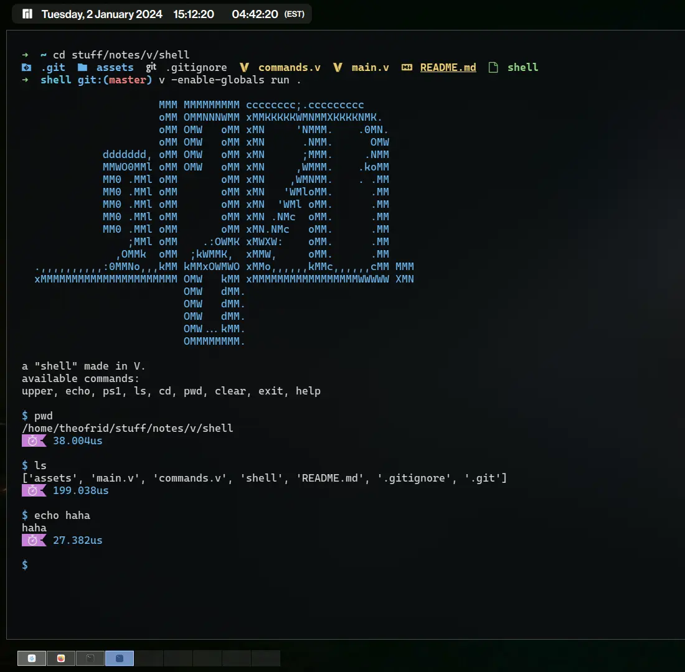

# chumma

a "shell" written in V, for the purposes of playing around with [V](https://vlang.io).

## screenshot

## prerequisites

1. a working installation of V. (head over to [vlang.io](https://vlang.io) to install V)

## compilation

`v -enable-globals -prod .`
